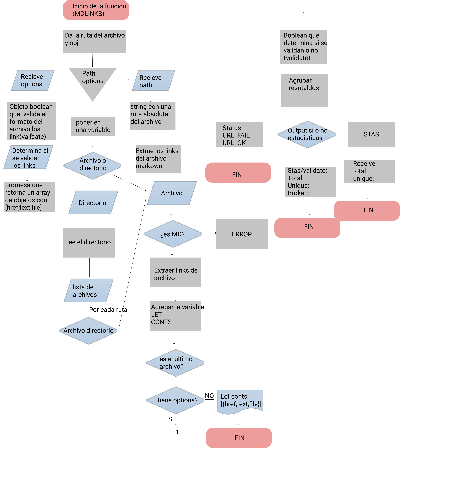

# Markdown Links

## Índice
- [Markdown Links](#markdown-links)
  - [Índice](#índice)
  - [1. Preámbulo](#1-preámbulo)
  - [2. Resumen del desarrollo del proyecto](#2-resumen-del-desarrollo-del-proyecto)
  - [3. Diagrama de flujo](#3-diagrama-de-flujo)
  - [4. Instalación](#4-instalación)
  - [5. Uso de Cli](#5-uso-de-cli)
  - [6. Objetivos de aprendizaje](#6-objetivos-de-aprendizaje)
    - [JavaScript](#javascript)
    - [Node](#node)
    - [Testing](#testing)
    - [Estructura del código y guía de estilo](#estructura-del-código-y-guía-de-estilo)
    - [Git y GitHub](#git-y-github)
    - [HTTP](#http)
    - [Fundamentos de programación](#fundamentos-de-programación)
  - [7. Checklist](#7-checklist)
    - [General](#general)
    - [`README.md`](#readmemd)
    - [API `mdLinks(path, opts)`](#api-mdlinkspath-opts)
    - [CLI](#cli)
    - [Pruebas / tests](#pruebas--tests)


## 1. Preámbulo

Este es el cuarto proyecto que desarrollamos en el Bootcamp de [Laboratoria]. 
El objetivo principal de aprendizaje en este proyecto es crear una herramienta de línea de comando (CLI) así como una libreria propia (o biblioteca - library) en JavaScript.

## 2. Resumen del desarrollo del proyecto

Tras leer el [README]Comencé la planeación de la función principal con su respectivo diagrama de flujo, donde  se llevó a cabo una sesión de feedback todos los dias donde tuvimos la oportunidad de hacer mejoras y mostrar los avances.
Forkeamos el proyecto base, lo desarrollamos localmente, desarrollamos la estructura básica en index.js, luego me enfoque en la función mientras generaba recursos con node.js e interactuábamos con git y asi mismo me enfoque en manipular las funciones para testearlas.

## 3. Diagrama de flujo



## 4. Instalación

``$ npm install -g loregunner/bog001-md-links``

## 5. Uso de Cli 

Recibe como comandos el nombre *mdlinks* y el nombre de una archivo ".md" o una carpeta que contenga un archivo ".md".

*Al ejecutar el siguiente comando, te imprime un arreglo de objetos con href, el titulo dado al enlace, el archivo donde se encontró el enlace*

``$ mdlinks <path>``

```
 {
    text: 'marked',
    href: 'https://github.com/markedjs/marked',
    file: 'C:\\Users\\Asus\\Documents\\bog001-md-links\\ArchivosMD\\testREADME.md'
  },
```
*Al ejecutar el siguiente comando, te imprime un arreglo de objetos con href, el titulo dado al enlace, el archivo donde se encontró el enlace, pero le agregamos la validación con status*

``$ mdlinks <path> --validate``

```
{
    href: 'http://kissmanga.com/',
    text: ' 5. Kissmanga',
    file: 'C:\\Users\\Asus\\Documents\\bog001-md-links\\ArchivosMD\\testREADME.md',
    status: 404,
    validate: 'fail'
  }
```

*Si ejecutas el siguiente comando con --stats, te muestra cuantos enlaces hay en total y cuantos son únicos*

``$ mdlinks <path> --stats``

```
  Total: 70
  unique: 65
```

*Si ejecutas el siguiente comando con --validate --stats, verifica el status de los links y te imprime cuantos enlaces hay en total, cuantos son únicos y cuantos están rotos*

``$ mdlinks <path> --stats --validate``

```
     {
    href: 'http://kissmanga.com/',
    text: ' 5. Kissmanga',
    file: 'C:\\Users\\Asus\\Documents\\bog001-md-links\\ArchivosMD\\testREADME.md',
    status: 404,
    validate: 'fail'
    }
   Total: 70
   unique: 65
   broken: 12

```

## 6. Objetivos de aprendizaje

Diseñar tu propia librería es una experiencia fundamental para cualquier
desarrollador porque que te obliga a pensar en la interfaz (API) de tus
_módulos_ y cómo será usado por otros developers. Debes tener especial
consideración en peculiaridades del lenguaje, convenciones y buenas prácticas.

A continuación puedes ver los objetivos de aprendizaje de este proyecto:

### JavaScript

* [x] Uso de condicionales (if-else | switch | operador ternario)
* [x] Uso de funciones (parámetros | argumentos | valor de retorno)
* [x] Manipular arrays (filter | map | sort | reduce)
* [x] Manipular objects (key | value)
* [x] Uso ES modules ([`import`](https://developer.mozilla.org/en-US/docs/Web/JavaScript/Reference/Statements/import)
| [`export`](https://developer.mozilla.org/en-US/docs/Web/JavaScript/Reference/Statements/export))
* [x] Diferenciar entre expression y statements.
* [x] Diferenciar entre tipos de datos atómicos y estructurados.
* [x] [Uso de callbacks.](https://developer.mozilla.org/es/docs/Glossary/Callback_function)
* [x] [Consumo de Promesas.](https://scotch.io/tutorials/javascript-promises-for-dummies#toc-consuming-promises)
* [x] [Creación de Promesas.](https://www.freecodecamp.org/news/how-to-write-a-javascript-promise-4ed8d44292b8/)

### Node

* [x] Uso de sistema de archivos. ([fs](https://nodejs.org/api/fs.html), [path](https://nodejs.org/api/path.html))
* [x] Instalar y usar módulos. ([npm](https://www.npmjs.com/))
* [x] Creación de modules. [(CommonJS)](https://nodejs.org/docs/latest-v0.10.x/api/modules.html)
* [x] [Configuración de package.json.](https://docs.npmjs.com/files/package.json)
* [x] [Configuración de npm-scripts](https://docs.npmjs.com/misc/scripts)
* [x] Uso de CLI (Command Line Interface - Interfaz de Línea de Comando)

### Testing

* [x] [Testeo unitario.](https://jestjs.io/docs/es-ES/getting-started)
* [x] [Testeo asíncrono.](https://jestjs.io/docs/es-ES/asynchronous)
* [x] [Uso de librerias de Mock.](https://jestjs.io/docs/es-ES/manual-mocks)
* [x] Uso de Mocks manuales.
* [ ] Testeo para múltiples Sistemas Operativos.

### Estructura del código y guía de estilo

* [x] Organizar y dividir el código en módulos (Modularización)
* [x] Uso de identificadores descriptivos (Nomenclatura | Semántica)
* [ ] Uso de linter (ESLINT)

### Git y GitHub

* [x] Uso de comandos de git (add | commit | pull | status | push)
* [x] Manejo de repositorios de GitHub (clone | fork | gh-pages)
* [ ] Colaboración en Github (branches | pull requests | |tags)
* [ ] Organización en Github (projects | issues | labels | milestones)

### HTTP

* [x] Verbos HTTP ([http.get](https://nodejs.org/api/http.html#http_http_get_options_callback))

### Fundamentos de programación

* [ ] [Recursión.](https://www.youtube.com/watch?v=lPPgY3HLlhQ)

***

**Agrego la checklist para complementar**

## 7. Checklist

### General

* [x] Puede instalarse via `npm install --global <github-user>/md-links`

### `README.md`

* [x] Un board con el backlog para la implementación de la librería.
* [x] Documentación técnica de la librería.
* [x] Guía de uso e instalación de la librería

### API `mdLinks(path, opts)`

* [x] El módulo exporta una función con la interfaz (API) esperada.
* [x] Implementa soporte para archivo individual
* [x] Implementa soporte para directorios
* [x] Implementa `options.validate`

### CLI

* [x] Expone ejecutable `md-links` en el path (configurado en `package.json`)
* [x] Se ejecuta sin errores / output esperado
* [x] Implementa `--validate`
* [x] Implementa `--stats`

### Pruebas / tests

* [x] Pruebas unitarias cubren un mínimo del 70% de statements, functions,
  lines, y branches.
* [x] Pasa tests (y linters) (`npm test`).
